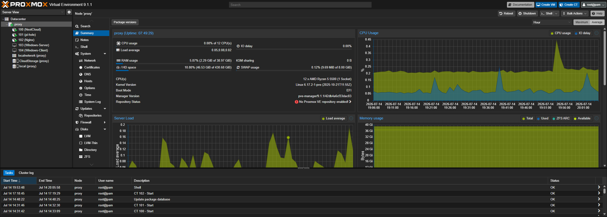

# Proxmox Virtualization Host

The Proxmox host is the primary compute server in my homelab. It provides the virtualization platform for running virtual machines and Linux containers that host the majority of my self-hosted services.

Rather than purchasing dedicated hardware for each service, Proxmox allows multiple workloads to run on a single system while remaining isolated from one another. This makes it easy to deploy new services, test operating systems, and rebuild environments without affecting the rest of the network.

## Specifications

| Specification | Value |
|--------------|-------|
| Host OS | Proxmox VE 9.1.1 |
| Kernel | Linux 6.17.2-1-pve |
| CPU | AMD Ryzen 5 5500 |
| Cores / Threads | 6 Cores / 12 Threads |
| Max Clock | Up to 4.27 GHz |
| Virtualization | AMD-V |
| Memory | 40 GB DDR4 (38 GiB usable) |
| Boot Drive | 447 GB SSD |
| Data Storage | 2 TB HDD |
| Hypervisor Storage | LVM |
| Primary Network | vmbr0 Linux Bridge |
| Physical NIC | 1 × Gigabit Ethernet |

## Current Workloads

### Linux Containers (LXC)

- Nextcloud
- Pi-hole
- Nginx Proxy Manager

### Virtual Machines

- Windows Server (In Progress)
- Windows Client (In Progress)

## Responsibilities

The Proxmox host currently provides:

- Virtual machine hosting
- Linux container hosting
- Self-hosted cloud storage
- Network-wide DNS filtering
- Reverse proxy services
- Centralized virtualization management
- Storage management
- Snapshot support

## Planned Projects

As my homelab continues to grow, I plan to implement:

- Active Directory Domain Services
- Windows DNS
- Windows DHCP
- Group Policy
- Domain-joined Windows clients
- Additional Linux servers (RHEL, Arch Linux, Debian)
- Automated backups
- Monitoring and alerting
- Additional self-hosted services

## Why I Chose It

I wanted a platform that would allow me to learn enterprise virtualization while making efficient use of a single physical server.

Proxmox VE provides many of the same virtualization concepts used in enterprise environments, including virtual machines, Linux containers, snapshots, virtual networking, storage pools, and web-based management.

Using Proxmox also allows me to quickly rebuild labs without reinstalling operating systems on physical hardware, making it ideal for experimenting with networking, Windows Server, and Linux administration.

## Pros

- Open-source enterprise hypervisor
- Excellent web management interface
- Supports both virtual machines and Linux containers
- Snapshot and backup capabilities
- Low hardware overhead
- Strong hardware performance from the Ryzen 5 5500
- Plenty of memory for running multiple workloads simultaneously
- Large storage capacity for self-hosted services

## Cons

- Single physical host (no High Availability)
- Limited to Gigabit networking
- Storage is not redundant
- No ECC memory
- Hardware upgrades require downtime

## Network Placement

```
Internet
    │
    ▼
Motorola MB7621
    │
    ▼
pfSense Firewall
    │
    ▼
Cisco Catalyst WS-C2960CG-8TC-L
    │
    ├── ASUS GT-AC2900
    ├── Proxmox Host
    │      ├── Nextcloud
    │      ├── Pi-hole
    │      ├── Nginx Proxy Manager
    │      ├── Windows Server
    │      └── Windows Client
    ├── Desktop PC
    ├── Laptop
```

